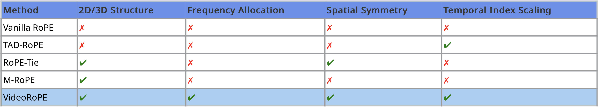

#  VideoRoPE: What Makes for Good Video Rotary Position Embedding?


🚀🚀🚀 Official implementation of **VideoRoPE: What Makes for Good Video Rotary Position Embedding?**

<p align="center">
  
</p>

- **Authors**: [Xilin Wei*](https://github.com/Wiselnn570), [Xiaoran Liu*](https://scholar.google.de/citations?user=Qe6F4J4AAAAJ&hl=en), [Yuhang Zang](https://yuhangzang.github.io), [Xiaoyi Dong](https://lightdxy.github.io), [Pan Zhang](https://panzhang0212.github.io/), [Yuhang Cao](https://scholar.google.com/citations?user=sJkqsqkAAAAJ&hl=en), [Jian Tong](), [Haodong Duan](https://kennymckormick.github.io/), [Qipeng Guo](https://scholar.google.com/citations?user=k3mPGKgAAAAJ&hl=en), [Jiaqi Wang](https://myownskyw7.github.io/), [Xipeng Qiu](https://xpqiu.github.io/en.html), [Dahua Lin](http://dahua.site/)
- **Institutes**: Fudan University; Shanghai AI Laboratory; Shanghai Innovation Institute
- **Resources**: [📖[Paper](https://arxiv.org/pdf/2502.05173)] [[🏠Project Page](https://wiselnn570.github.io/VideoRoPE/)] [[🤗Huggingface]()]
## 💡 Highlights

- 🔥 **Four Key Positional Encoding Schemes:** We present an analysis of four key properties essential for RoPE when applied to video. Motivated by this analysis, we propose **VideoRoPE** including **Low-frequency Temporal Allocation (LTA)**, **Diagonal Layout (DL)**, and **Adjustable Temporal Spacing (ATS)** to satisfy all four properties.
- 🔥 **A Challenging Video Haystack Retrieval Benchmark:** We introduce the challenging **V-NIAH-D** task to expose the drawbacks of current position embedding designs regarding frequency allocation. Our findings reveal that existing Video LLMs are easily misled to frequency-based distractors.
- 🔥 **Excellent Performance:** Extensive experiments demonstrate that VideoRoPE consistently achieves superior performance compared to other RoPE variants. For example, VideoRoPE outperforms previous M-RoPE on long video retrieval (+12.4 on V-NIAH, +12.4 on V-NIAH-D), video understanding (+2.9 on LongVideoBench, +4.5 on MLVU, +1.7 on Video-MME) and hallucination (+11.9 on VideoHallucer) benchmarks.

## 📜 News

<!-- **[2024/10/1]** ShareGPT4Video was accepted by NeurIPS 2024 D&B track!

**[2024/7/1]** The code about batch-inference of ShareCaptioner-Video is available now!

**[2024/6/11]** The web demo and local demo of ShareCaptioner-Video are available now!

**[2024/6/11]** The web demo and local demo of ShareGPT4Video-8B are available now!

**[2024/6/7]** Our paper has been featured as [HuggingFace Daily Papers](https://huggingface.co/papers?date=2024-06-07) and ranked 1st in 6.7. -->

**[2025/3/7]** The training code has been added to the repository, please check it out.

**[2025/2/14]** [Code]() and [Project Page](https://wiselnn570.github.io/VideoRoPE/) are released!

<!-- ## 👨‍💻 Todo

- [✓] VideoRoPE Implementation with *transformers*
- [✓] VideoRoPE Implementation with *vLLM*
- [✓] V-NIAH-D Release
- [] VideoRoPE-Based Model Checkpoints -->


## 🛠️ Usage

- The implementation of videorope is emphasized with **#!**, and you can easily find it by pressing ctrl + F.
- For transformer inference:
  ```
  with torch.inference_mode():
      generated_ids = model.generate(
        ..., 
        which_rope=which_rope,
        scale_factor=scale_factor
      )
      generated_ids_trimmed = [
          out_ids[len(in_ids) :] for in_ids, out_ids in zip(inputs.input_ids, generated_ids)
      ]
      output_text = processor.batch_decode(
          generated_ids_trimmed, skip_special_tokens=True, clean_up_tokenization_spaces=False
      )
      generated_text = output_text[0]
  ```
- For vLLM inference:
  ```
  mm_data['which_rope'] = which_rope
  mm_data['scale_factor'] = scale_factor
  llm_inputs = {
      "prompt": prompt,
      "multi_modal_data": mm_data,
  }
  with torch.no_grad():
      outputs = llm.generate([llm_inputs], sampling_params=sampling_params)
  generated_text = outputs[0].outputs[0].text
  ```
<!-- ## Quick Usage

You can directly use our ShareGPT4Video model for conversation with your own video by the following command:

```
python run.py --model-path Lin-Chen/sharegpt4video-8b --video examples/yoga.mp4 --query Describe this video in detail.
```

Or you can build your local demo to enjoy our ShareGPT4Video-8B with the following command:

```
python app.py
```

You can build your local demo for enjoying our ShareCaptioner-Video with the following command:

```
cd captioner

python app.py
```

## Install

```bash
git clone https://github.com/ShareGPT4Omni/ShareGPT4Video
conda create -n share4video python=3.10 -y
conda activate share4video

cd ShareGPT4Video
pip install --upgrade pip
pip install -e .
pip install -e ".[train]"
pip install flash-attn --no-build-isolation
```
 -->

## Train

To verify the superiority of VideoRoPE, we use the diverse and high-quality video dataset [LLaVA-Video-178K](https://huggingface.co/datasets/lmms-lab/LLaVA-Video-178K) for video fine-tuning. To balance training efficiency and long-video comprehension, we randomly select 136K videos with durations under 2 minutes and 18K videos with durations between 2 and 3 minutes.

Once the data is prepared, one can fine-tune model following the training data format of [LLaMA-Factory](https://github.com/hiyouga/LLaMA-Factory):

```sh
cd LLaMA-Factory
sh multi_gpu_sft_slurm.sh
```
*It is important to note that in order to align with the training format of Qwen2-VL, we mainly made adjustments to LLaMA-Factory/src/llamafactory/data/mm_plugin.py.*

## ✒️ Citation

If you find our work helpful for your research, please consider giving a star ⭐ and citation 📝

```bibtex
@article{wei2025videorope,
  title={VideoRoPE: What Makes for Good Video Rotary Position Embedding?},
  author={Wei, Xilin and Liu, Xiaoran and Zang, Yuhang and Dong, Xiaoyi and Zhang, Pan and Cao, Yuhang and Tong, Jian and Duan, Haodong and Guo, Qipeng and Wang, Jiaqi and others},
  journal={arXiv preprint arXiv:2502.05173},
  year={2025}
}
```

## ❤️ Acknowledgments

- [transformers](https://github.com/huggingface/transformers): the codebase we built upon. Thanks for their wonderful work.
- [vLLM](https://github.com/PKU-YuanGroup/Open-Sora-Plan): an excellent open-source codebase for high-throughput and memory-efficient inference. Thanks for their wonderful work.
- [Qwen2-VL](https://github.com/QwenLM/Qwen2.5-VL): the amazing open-sourced multimodal large language model!
- [LLaMA-Factory](https://github.com/hiyouga/LLaMA-Factory): Wonderful job in facilitating LLMs & VLMs training.