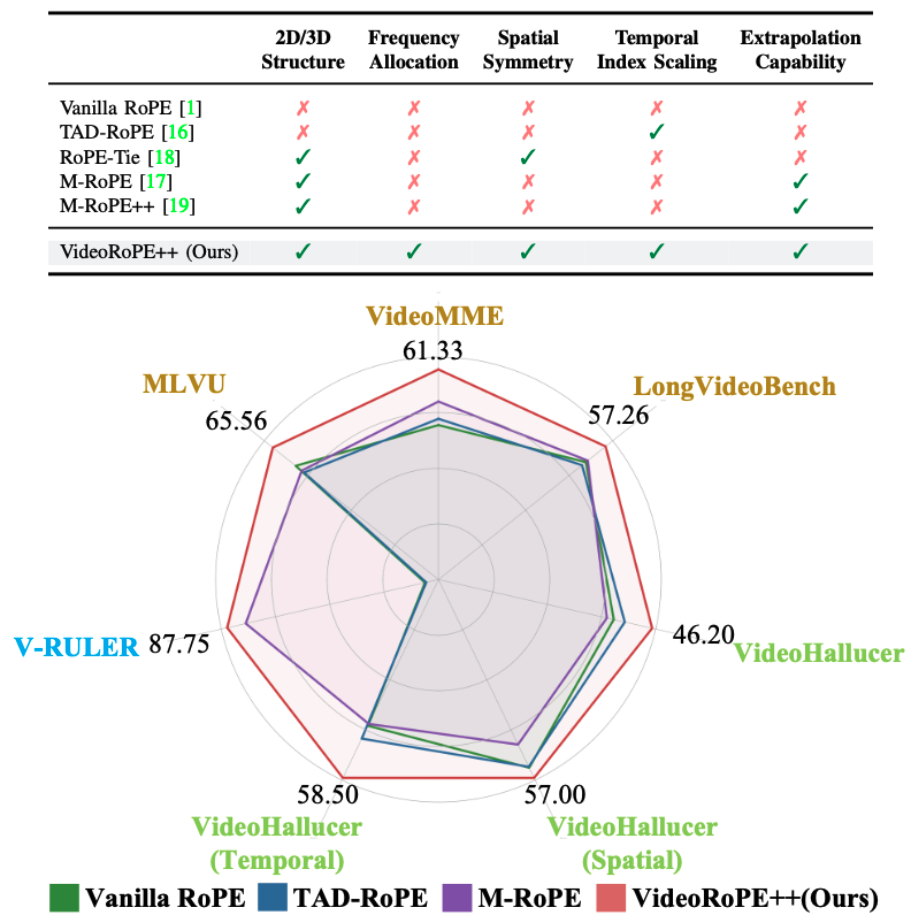

<h1 align="center">
 VideoRoPE++: Towards Better Video Rotary Position Embedding
  <br>
</h1>

🚀🚀🚀 Official implementation of **VideoRoPE++: Towards Better Video Rotary Position Embedding**

- **Authors**: [Xilin Wei](https://github.com/Wiselnn570), [Xiaoran Liu](https://scholar.google.de/citations?user=Qe6F4J4AAAAJ&hl=en), [Yuhang Zang](https://yuhangzang.github.io), [Shengyuan Ding](https://github.com/SYuan03), [Xiaoyi Dong](https://lightdxy.github.io), [Pan Zhang](https://panzhang0212.github.io/), [Yuhang Cao](https://scholar.google.com/citations?user=sJkqsqkAAAAJ&hl=en), [Haodong Duan](https://kennymckormick.github.io/), [Qipeng Guo](https://scholar.google.com/citations?user=k3mPGKgAAAAJ&hl=en), [Jiaqi Wang](https://myownskyw7.github.io/), [Xipeng Qiu](https://xpqiu.github.io/en.html), [Dahua Lin](http://dahua.site/)
- **Institutes**: Fudan University; Shanghai AI Laboratory; Shanghai Innovation Institute
- **Resources**: [📖[Paper](https://github.com/Wiselnn570/VideoRoPE/blob/main/VideoRoPE_plus.pdf)] [[🏠Project Page](https://wiselnn570.github.io/VideoRoPE/)] [[🤗Huggingface](https://huggingface.co/collections/Wiselnn/videorope-what-makes-for-good-video-rotary-position-embeddi-67ca90664c8e169422449c56)]

<p align="center">
  
</p>

## 💡 Highlights

- 🔥 **Five Key Positional Encoding Schemes:** We present an analysis of five key properties essential for applying RoPE to video data. Motivated by this analysis, we propose **VideoRoPE++**, which incorporates **Low-frequency Temporal Allocation (LTA)**, **Diagonal Layout (DL)**, **Adjustable Temporal Spacing (ATS)**, and **YaRN-V** to fulfill all five properties. This work represents a further step forward in exploring positional encoding and its extrapolation capabilities in video.
- 🔥 **A More Comprehensive and Challenging Video Haystack Retrieval Benchmark** We introduce the more challenging **V-RULER** task, which enhances the **V-NIAH-D** benchmark with multi-key multi-value retrieval, lengthy multimodal stacks, needle retrieval under distractors, as well as counting and ordering tasks.
- 🔥 **Excellent Performance:** Extensive experiments demonstrate that VideoRoPE consistently achieves superior performance compared to other RoPE variants. For example, VideoRoPE outperforms previous M-RoPE on long video retrieval (+12.4 on V-NIAH, +12.4 on V-NIAH-D), video understanding (+2.9 on LongVideoBench, +4.5 on MLVU, +1.7 on Video-MME) and hallucination (+11.9 on VideoHallucer) benchmarks.

## ✒️ Citation

If you find our work helpful for your research, please consider giving a star ⭐ and citation 📝

```bibtex
@inproceedings{wei2025videorope,
  title={VideoRoPE: What Makes for Good Video Rotary Position Embedding?},
  author={Wei, Xilin and Liu, Xiaoran and Zang, Yuhang and Dong, Xiaoyi and Zhang, Pan and Cao, Yuhang and Tong, Jian and Duan, Haodong and Guo, Qipeng and Wang, Jiaqi and others},
  booktitle={International Conference on Machine Learning},
  year={2025}
}

@misc{wei2025videoropepp,
  author       = {Xilin Wei and Xiaoran Liu and Yuhang Zang and Shengyuan Ding and Xiaoyi Dong and Yuhang Cao and Haodong Duan and Qipeng Guo and Jiaqi Wang and Xipeng Qiu and Dahua Lin},
  title        = {VideoRoPE++: Towards Better Video Rotary Position Embedding},
  year         = {2025},
  howpublished = {\url{https://github.com/Wiselnn570/VideoRoPE/blob/main/videorope_plus/VideoRoPE_plus.pdf}},
  doi={10.5281/zenodo.16529245}
}
```

## ❤️ Acknowledgments

- [transformers](https://github.com/huggingface/transformers): the codebase we built upon. Thanks for their wonderful work.
- [vLLM](https://github.com/PKU-YuanGroup/Open-Sora-Plan): an excellent open-source codebase for high-throughput and memory-efficient inference. Thanks for their wonderful work.
- [Qwen2-VL](https://github.com/QwenLM/Qwen2.5-VL): the amazing open-sourced multimodal large language model!
- [LLaMA-Factory](https://github.com/hiyouga/LLaMA-Factory): Wonderful job in facilitating LLMs & VLMs training.
